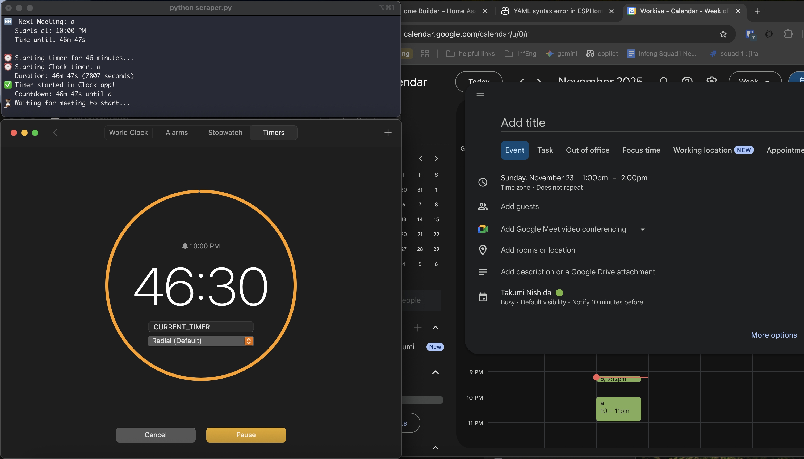
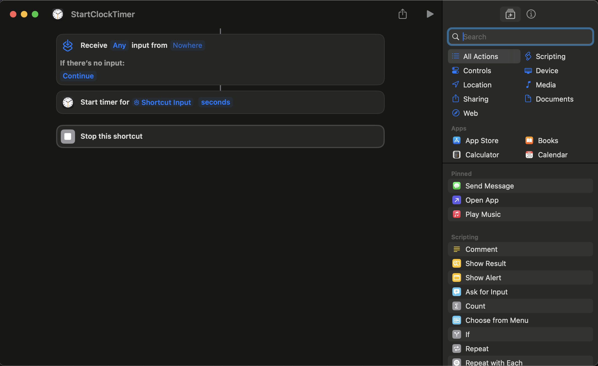

# 🗓️ Google Calendar Countdown Timer

A macOS tool that automatically reads your Google Calendar and starts native Clock app timers for upcoming meetings—no OAuth required!



## ✨ Features

- 🔄 **Continuous monitoring** - Automatically queues timers for all meetings throughout the day
- ⏱️ **Native Clock app integration** - Uses macOS Clock app for countdown timers
- 🚫 **No OAuth hassle** - Uses your existing Chrome login
- 🤖 **Fully automated** - Set it and forget it

## 🚀 Quick Start

### 1. Install Dependencies

```bash
python3 -m venv venv
source venv/bin/activate
pip install -r requirements.txt
```

### 2. Configure Chrome Profile

1. Open Chrome and go to `chrome://version`
2. Copy the **Profile Path** (e.g., `/Users/yourname/Library/Application Support/Google/Chrome/Default`)
3. Edit `scraper.py` lines 17-19 with your paths:

```python
CHROME_USER_DATA_DIR = "/Users/yourname/Library/Application Support/Google/Chrome"
CHROME_PROFILE_DIRECTORY = "Default"  # or "Profile 1", "Profile 2", etc.
```

### 3. Create macOS Shortcut

**This is required for Clock app automation!**

1. Open the **Shortcuts** app on macOS
2. Create a new shortcut named `StartClockTimer`
3. Add these three actions:
   - **Receive Any from nowhere**
   - **Start timer** for **Shortcut Input** seconds
   - **Stop this shortcut**



See `shortcut-config.png` for the exact setup.

### 4. Grant Permissions

When you first run the script, you'll be prompted to allow:
- **Shortcuts to receive input** from the Python script → Click "Always Allow"
- **Clock app automation** → Click "Always Allow"

These are one-time permissions.

### 5. Run

```bash
python scraper.py
```

The script will:
1. Read all events from your Google Calendar
2. Start a countdown timer in Clock app for the next meeting
3. Wait for the meeting to start and end
4. Automatically queue the next meeting's timer
5. Continue throughout the day

Press `Ctrl+C` to stop.

## ⚙️ Configuration

Edit these settings at the top of `scraper.py`:

```python
CHROME_USER_DATA_DIR = "/Users/yourname/Library/Application Support/Google/Chrome"
CHROME_PROFILE_DIRECTORY = "Default"  # Usually "Default" or "Profile 1", "Profile 2"
CALENDAR_LOAD_WAIT = 3  # Seconds to wait for calendar to load
```

## 🔧 Troubleshooting

**"Timer command timed out"**
- Make sure you created the `StartClockTimer` shortcut (see step 3 above)
- Check that you allowed permissions for Shortcuts and Clock app
- Test the shortcut manually: `echo "60" | shortcuts run "StartClockTimer"`

**No events found?**
- Make sure you have events with specific times (not all-day events)
- Chrome must be logged into the Google account with your calendar
- Verify your Chrome profile path matches `chrome://version`

**Python 3.13 errors?**
- Use Python 3.12: `brew install python@3.12`
- Then recreate the venv: `python3.12 -m venv venv`

**Chrome profile copy errors?**
- Make sure Chrome is completely closed before running
- The script needs to read your Chrome profile files

## 📝 How It Works

1. Copies your Chrome profile (with Google login) to a temporary location
2. Opens Google Calendar in headless Chrome (runs in background)
3. Scrapes visible events from the week view
4. Closes Chrome and processes the events
5. Identifies today's upcoming meetings
6. Uses macOS Shortcuts to start a Clock app timer for the next meeting
7. Waits for the meeting to start and end
8. Queues the next meeting and repeats throughout the day

## 🙏 Credits

Built with:
- [undetected-chromedriver](https://github.com/ultrafunkamsterdam/undetected-chromedriver) - For bypassing Chrome detection
- [Selenium](https://www.selenium.dev/) - For browser automation
- macOS Shortcuts & Clock app - For native timer integration

